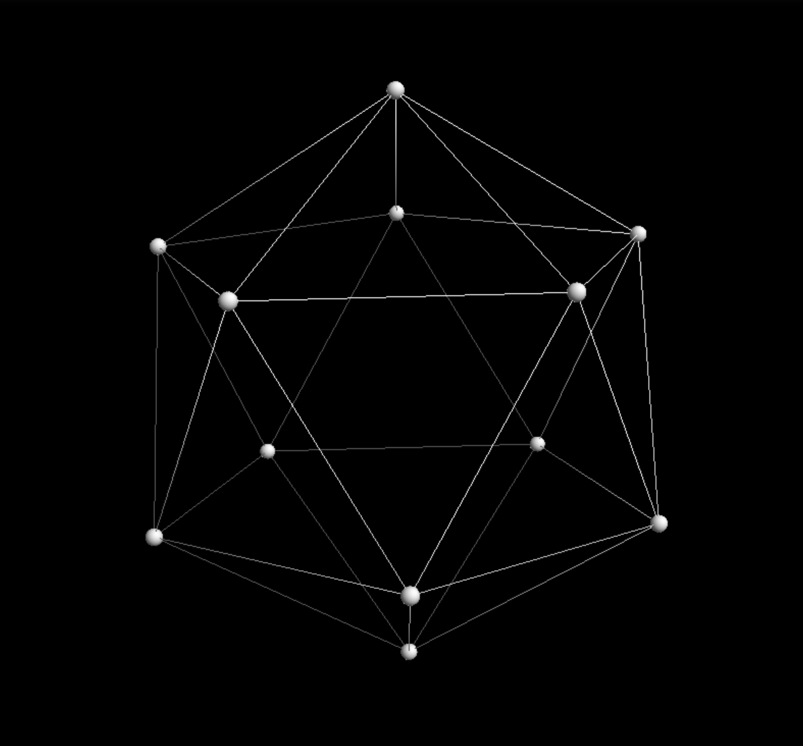
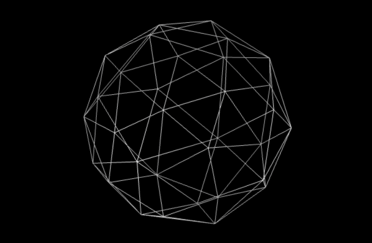

# n-geodesic
Uses tensorflow and jupyter notebook to find the lowest energy placement of n vertexes on a sphere and then displays in 3D using pythreejs

Creates model of N unit vectors specified in 3D polar coordinates theta and phi. A tensorflow compute graph is then constructed that measures the equivalent of electric charge potential ( 1/distance = potential ) between all the vertex pairs and sums them up to compute a single potential scalar. Gradient Descent is then used to find the coordinate that minimizes the potential.

The resulting points are then run the a library to extract the surface polygons (Convex Hull) and render via pythreejs.

## 12 Points

## 32 Points

